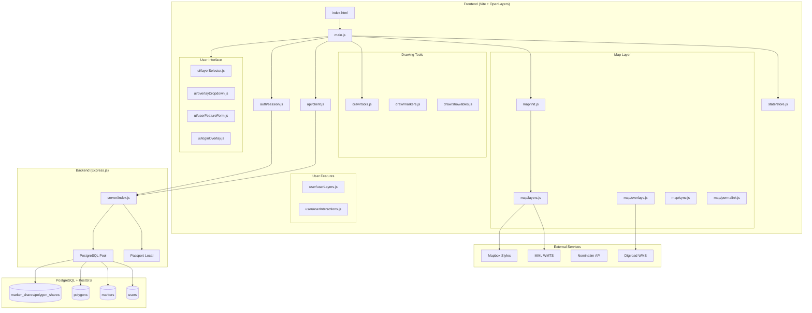

# MML Map - Architecture Documentation

> Comprehensive technical documentation for future feature implementation.

## Table of Contents

1. [Project Overview](#project-overview)
2. [Technology Stack](#technology-stack)
3. [Directory Structure](#directory-structure)
4. [Architecture Diagram](#architecture-diagram)
5. [Module Reference](#module-reference)
6. [Data Flow](#data-flow)
7. [State Management](#state-management)
8. [API Reference](#api-reference)
9. [Extension Points](#extension-points)
10. [Development Guidelines](#development-guidelines)

---

## Project Overview

MML Map is a Finnish map visualization application built with OpenLayers and Vite. It provides:

- **Base Maps**: WMTS from Maanmittauslaitos (MML), OpenStreetMap, Mapbox styles, Esri World Imagery, CartoDB
- **Split View**: Side-by-side map comparison with synchronized navigation
- **Overlays**: WMS (Digiroad), OSM GeoJSON datasets
- **Drawing Tools**: Markers, lines, polygons, measurement
- **User Features**: Persistent markers/polygons with authentication and sharing
- **Search**: Nominatim (OSM) Autocomplete integration
- **Permalinks**: Full URL state for sharing map views

---

## Technology Stack

| Component | Technology | Version |
|-----------|------------|---------|
| **Frontend** | OpenLayers | 10.5.0 |
| **Build Tool** | Vite | 6.1.6 |
| **Vector Tiles** | ol-mapbox-style | 13.0.1 |
| **Backend** | Express.js | - |
| **Database** | PostgreSQL + PostGIS | - |
| **Auth** | Passport.js (Local Strategy) | - |
| **Deployment** | Docker + Caddy | - |

---

## Directory Structure

```
mml-map/
├── src/                      # Frontend source
│   ├── main.js              # Entry point & bootstrap
│   ├── api/                 # API client functions
│   │   ├── client.js        # CRUD for markers/polygons
│   │   └── osm.js           # Taginfo & Overpass client
│   ├── auth/                # Authentication
│   │   └── session.js       # Session management
│   ├── config/              # Configuration
│   │   └── constants.js     # API keys, layer definitions
│   ├── draw/                # Drawing tools
│   │   ├── tools.js         # Draw interactions
│   │   ├── markers.js       # Marker display
│   │   ├── showables.js     # Feature visibility
│   │   └── helpers.js       # Drawing utilities
│   ├── map/                 # Map core
│   │   ├── init.js          # Map initialization
│   │   ├── layers.js        # Layer creation
│   │   ├── overlays.js      # Overlay management
│   │   ├── sync.js          # Split view sync
│   │   ├── permalink.js     # URL state
│   │   ├── overlayInfoClick.js  # Feature info clicks
│   │   └── osmInteractions.js   # OSM hover/click
│   │   └── osmDynamicLayers.js  # Dynamic Overpass layers
│   ├── overlays/            # Overlay data
│   │   └── fetchCapabilities.js # WMS capabilities
│   ├── search/              # Search
│   │   └── nominatim.js     # Nominatim Search
│   ├── state/               # State management
│   │   └── store.js         # Global state
│   ├── ui/                  # UI components
│   │   ├── layerSelector.js # Base layer dropdown
│   │   ├── overlayDropdown.js # Overlay selector
│   │   ├── overlayInfo.js   # Feature info popup
│   │   ├── osmPopup.js      # OSM popups
│   │   ├── osmFeatureSearch.js # Dynamic OSM search UI
│   │   ├── osmLegend.js     # OSM legend
│   │   ├── loginOverlay.js  # Login form
│   │   ├── userFeatureForm.js # Feature edit form
│   │   └── featurePicker.js # Feature selection
│   ├── user/                # User features
│   │   ├── userLayers.js    # User marker/polygon layers
│   │   └── userInteractions.js # User feature events
│   └── utils/               # Utilities
│       ├── coords.js        # Coordinate helpers
│       └── query.js         # URL query parsing
├── server/                  # Backend
│   └── index.js             # Express server
├── public/                  # Static assets
│   └── osm/                 # OSM GeoJSON files
├── scripts/                 # Build scripts
│   └── generate-osm-manifest.mjs
├── index.html               # HTML entry
├── vite.config.js           # Vite configuration
├── docker-compose.yml       # Docker services
└── Caddyfile                # Caddy config
```

---

## Architecture Diagram



---

## Module Reference

### Entry & Bootstrap

#### `src/main.js`
The application entry point that orchestrates initialization:

```javascript
// Key functions:
bootstrap()                    // Main init sequence
showSingleLayerSelector()      // Toggle layer selector visibility
loadUserFeaturesFromServer()   // Load persisted features
activateSplitScreen()          // Enable split view
deactivateSplitScreen()        // Disable split view
restoreFeaturesFromURL()       // Restore from permalink
```

**Bootstrap Flow:**
1. Check authentication (`getSession()`)
2. Show login overlay if not authenticated
3. Load WMTS capabilities
4. Parse URL parameters
5. Create base map
6. Set up UI elements (layer selector, overlays, search)
7. Wire drawing tools
8. Set up OSM interactions
9. Activate split screen if needed
10. Load user features from server

---

### State Management

#### `src/state/store.js`
Centralized mutable state object:

| Property | Type | Description |
|----------|------|-------------|
| `map` | Map | Main OpenLayers map instance |
| `leftMap` / `rightMap` | Map | Split view maps |
| `isSplit` | boolean | Split view active |
| `drawingMode` | string | Current drawing mode |
| `userMarkers` | array | User-created markers |
| `userPolygons` | array | User-created polygons |
| `osmSelectedIds` | array | Selected OSM datasets |
| `overlayLayerObjects` | object | Active overlay layers by map key |
| `osmAssignedColors` | object | Color assignments for OSM datasets |

---

### Configuration

#### `src/config/constants.js`
External endpoints and layer definitions:

```javascript
// API Keys
mapboxAccessToken    // Mapbox vector tiles
apiKey              // MML API key

// Endpoints
capsUrl             // WMTS capabilities
wmsUrl              // Digiroad WMS
wmsCapabilitiesUrl  // WMS GetCapabilities

// Layer Definitions
hardcodedLayers = [
  { id: 'taustakartta', name: 'Taustakartta', type: 'wmts' },
  { id: 'osm', name: 'OpenStreetMap', type: 'osm' },
  { id: 'mapbox_dark', name: 'Mapbox Dark', type: 'mapbox', styleUrl: '...' },
  { id: 'esri_world_imagery', name: 'Esri World Imagery', type: 'esri_sat' },
  // ...
]
```

---

### Map Initialization

#### `src/map/init.js`
Map creation and configuration:

```javascript
loadCapabilities()     // Fetch WMTS capabilities
createBaseMap()        // Create main map
createSplitMaps()      // Create split view maps
parseInitialFromParams() // Parse URL state
```

#### `src/map/layers.js`
Layer factory supporting multiple providers:

| Type | Source | Notes |
|------|--------|-------|
| `wmts` | MML WMTS | API key appended per tile |
| `osm` | OpenStreetMap | Standard OSM tiles |
| `mapbox` | Mapbox | Vector tiles via `ol-mapbox-style` |
| `esri_sat` | Esri World Imagery | XYZ tiles |
| `cartodb_dark` | CartoDB | Dark basemap |

---

### Overlays

#### `src/map/overlays.js`
Overlay layer management:

```javascript
createWMSOverlayLayer(layerName)  // Create WMS layer
updateAllOverlays()               // Rebuild all overlays
```

**Overlay Types:**
1. **Digiroad WMS** - Road network overlays
2. **Generic WMS** - Additional WMS sources
3. **OSM GeoJSON** - Prefiltered OSM data files

**Color Assignment:**
OSM datasets get stable colors from `osmColorPalette` stored in `osmAssignedColors`.

#### `src/overlays/fetchCapabilities.js`
Fetches WMS capabilities and OSM manifest for overlay lists.

---

### Drawing Tools

#### `src/draw/tools.js`
Drawing interactions and handlers:

| Tool | Description | Persistence |
|------|-------------|-------------|
| **Marker** | Single point | Server (user feature) |
| **Line** | 2-point line | URL permalink |
| **Polygon** | Free polygon | Server (user feature) |
| **Measure** | Freehand measurement | URL permalink |

**Key Functions:**
```javascript
enableMarkerClickHandler()   // Activate marker placement
wireDrawButtons()           // Set up button handlers
wireRemoveFeaturesButton()  // Clear features button
```

**Flow:**
1. User clicks draw button
2. `drawingMode` set in state
3. Overlay info clicks disabled
4. Draw interaction added to map(s)
5. On draw end: save feature, open metadata form (for user features)
6. Persist to server or URL

#### `src/draw/showables.js`
Feature visibility across maps:
```javascript
showLine(coords)        // Display line on all maps
showPolygon(coords)     // Display polygon on all maps
showMeasureLine(coords) // Display measure line
clearDrawnFeatures()    // Remove drawn features
```

---

### User Features

#### `src/user/userLayers.js`
Persistent user-created features:

```javascript
ensureUserLayers()       // Create vector layers if needed
addUserMarkerToMaps()    // Add marker to all maps
addUserPolygonToMaps()   // Add polygon to all maps
updateUserMarkerById()   // Update marker properties
removeUserMarkerById()   // Delete marker
rebuildUserLayersAllMaps() // Full rebuild
```

**Feature Properties:**
- `dbId` - Server ID
- `title` - Display name
- `description` - Details
- `color` - Hex color
- `ownerUsername` - Creator
- `sharedUserIds` - Shared with users

#### `src/user/userInteractions.js`
Hover/click handlers for user features, triggering edit forms.

---

### Permalink

#### `src/map/permalink.js`
URL state serialization:

**URL Parameters:**
| Param | Description |
|-------|-------------|
| `lat`, `lon`, `z` | Map center and zoom |
| `layer` | Base layer ID (single view) |
| `split=1` | Enable split view |
| `leftLayer`, `rightLayer` | Split view layers |
| `line` | Line coordinates |
| `measure` | Measure coordinates |
| `overlays` | Selected WMS overlays |
| `osm` | Selected OSM datasets |

---

### Authentication

#### `src/auth/session.js`
Client-side auth functions:
```javascript
getSession()    // Check current session
login()         // Username/password login
logout()        // End session
listUsers()     // Get user list (for sharing)
```

#### `src/ui/loginOverlay.js`
Login form overlay - gates app behind authentication.

---

### Search

#### `src/search/nominatim.js`
Nominatim (OSM) Autocomplete integration:
- Wires to `#search-bar` input
- Debounced search queries to Nominatim API
- on place selection: recenters maps, drops search marker
- Configurable endpoint via `VITE_NOMINATIM_URL`

---

## API Reference

### Backend Endpoints (`server/index.js`)

#### Authentication
| Method | Endpoint | Description |
|--------|----------|-------------|
| GET | `/api/health` | Health check |
| GET | `/api/session` | Get current session |
| POST | `/api/login` | Login with credentials |
| POST | `/api/logout` | End session |
| GET | `/api/users` | List all users |

#### Markers
| Method | Endpoint | Description |
|--------|----------|-------------|
| GET | `/api/markers` | Get markers (owned + shared) |
| POST | `/api/markers` | Create marker |
| PATCH | `/api/markers/:id` | Update marker |
| DELETE | `/api/markers/:id` | Delete marker |

**Marker Payload:**
```json
{
  "lon": 24.94,
  "lat": 60.19,
  "title": "My Marker",
  "description": "Details",
  "color": "#00bcd4",
  "sharedUserIds": [2, 3]
}
```

#### Polygons
| Method | Endpoint | Description |
|--------|----------|-------------|
| GET | `/api/polygons` | Get polygons (owned + shared) |
| POST | `/api/polygons` | Create polygon |
| PATCH | `/api/polygons/:id` | Update polygon |
| DELETE | `/api/polygons/:id` | Delete polygon |

**Polygon Payload:**
```json
{
  "coordinates": [[lon, lat], ...],
  "title": "My Area",
  "description": "Details",
  "color": "#ff9800",
  "sharedUserIds": [2]
}
```

### Database Schema

```sql
-- Users
CREATE TABLE users (
  id SERIAL PRIMARY KEY,
  username TEXT UNIQUE NOT NULL,
  password_hash TEXT NOT NULL,
  created_at TIMESTAMPTZ DEFAULT now()
);

-- Markers with PostGIS geometry
CREATE TABLE markers (
  id SERIAL PRIMARY KEY,
  geom geometry(Point, 4326) NOT NULL,
  properties JSONB DEFAULT '{}',
  owner_user_id INTEGER REFERENCES users(id),
  created_at TIMESTAMPTZ DEFAULT now()
);

-- Polygons with PostGIS geometry
CREATE TABLE polygons (
  id SERIAL PRIMARY KEY,
  geom geometry(Polygon, 4326) NOT NULL,
  properties JSONB DEFAULT '{}',
  owner_user_id INTEGER REFERENCES users(id),
  created_at TIMESTAMPTZ DEFAULT now()
);

-- Sharing tables
CREATE TABLE marker_shares (
  marker_id INTEGER REFERENCES markers(id) ON DELETE CASCADE,
  user_id INTEGER REFERENCES users(id) ON DELETE CASCADE,
  PRIMARY KEY (marker_id, user_id)
);

CREATE TABLE polygon_shares (
  polygon_id INTEGER REFERENCES polygons(id) ON DELETE CASCADE,
  user_id INTEGER REFERENCES users(id) ON DELETE CASCADE,
  PRIMARY KEY (polygon_id, user_id)
);
```

---

## Extension Points

### Adding a New Base Layer

1. Add entry to `hardcodedLayers` in `src/config/constants.js`:
```javascript
{ id: 'my_layer', name: 'My Layer', type: 'xyz', url: 'https://...' }
```

2. Update `createTileLayerFromList()` in `src/map/layers.js`:
```javascript
if (layerInfo && layerInfo.type === 'xyz') {
  return new TileLayer({ source: new XYZ({ url: layerInfo.url }) });
}
```

### Adding a New Drawing Tool

1. Add button in `index.html` under `#draw-menu`
2. Add handler in `src/draw/tools.js`:
```javascript
newToolBtn.addEventListener('click', function() {
  state.drawingMode = 'newtool';
  // Set up interaction...
});
```

3. Add state properties to `src/state/store.js`

### Adding a New Overlay Source

1. Add capabilities URL to `src/config/constants.js`
2. Fetch capabilities in `src/overlays/fetchCapabilities.js`
3. Create layer factory in `src/map/overlays.js`
4. Add UI selector in `src/ui/overlayDropdown.js`

### Adding a New User Feature Type

1. Add database table in `server/index.js` `initDb()`
2. Add CRUD endpoints
3. Add client functions in `src/api/client.js`
4. Add layer management in `src/user/userLayers.js`
5. Add form handling in `src/ui/userFeatureForm.js`

---

## Development Guidelines

### Commands

```bash
# Install dependencies
npm ci

# Start dev server
npm run dev

# Production build
npm run build

# Regenerate OSM manifest
node scripts/generate-osm-manifest.mjs

# Start with Docker
docker-compose up
```

### Code Patterns

**State Access:**
```javascript
import { state } from '../state/store.js';
// Direct mutation
state.someProperty = value;
```

**Map Operations (split-aware):**
```javascript
['main', 'left', 'right'].forEach(key => {
  const mapObj = key === 'main' ? state.map 
    : key === 'left' ? state.leftMap : state.rightMap;
  if (!mapObj) return;
  // Operate on mapObj...
});
```

**Layer Management:**
```javascript
// Always track layers in state for cleanup
state.someLayerObjects[key].push(layer);
mapObj.addLayer(layer);

// On cleanup
state.someLayerObjects[key].forEach(l => mapObj.removeLayer(l));
state.someLayerObjects[key] = [];
```

### Environment Variables

| Variable | Default | Description |
|----------|---------|-------------|
| `PORT` | 3000 | Server port |
| `DATABASE_URL` | postgres://... | PostgreSQL connection |
| `SESSION_SECRET` | dev-secret | Session encryption |
| `ADMIN_PASSWORD` | admin | Initial admin user password |
| `VITE_TILE_CACHE_URL` | (empty) | Tile cache proxy URL (build-time) |
| `VITE_NOMINATIM_URL` | (empty) | Nominatim API URL (default: openstreetmap.org) |
| `NODE_ENV` | - | development/production |

### API Keys to Update

1. **Mapbox** - `src/config/constants.js` → `mapboxAccessToken`
2. **MML** - `src/config/constants.js` → `apiKey`

---

## Quick Reference

### File Import Paths

```javascript
// State
import { state } from '../state/store.js';

// Config
import { hardcodedLayers, apiKey } from '../config/constants.js';

// Map
import { createBaseMap, loadCapabilities } from '../map/init.js';
import { createTileLayerFromList } from '../map/layers.js';
import { updateAllOverlays } from '../map/overlays.js';
import { updatePermalinkWithFeatures } from '../map/permalink.js';

// Drawing
import { wireDrawButtons } from '../draw/tools.js';
import { showLine, showPolygon } from '../draw/showables.js';

// User features
import { addUserMarkerToMaps, rebuildUserLayersAllMaps } from '../user/userLayers.js';

// API
import { createMarker, createPolygon, fetchMarkers } from '../api/client.js';

// Auth
import { getSession, login, logout } from '../auth/session.js';
```

### Z-Index Hierarchy

| Base tiles | 0 |
| WMS overlays | 50 |
| OSM GeoJSON | 60 |
| Dynamic OSM (Overpass) | 150 |
| Drawn lines | 102 |
| Drawn polygons | 103 |
| Measure lines | 104 |
| User polygons | 190 |
| User markers | 200 |

---

*Last updated: January 2026*
